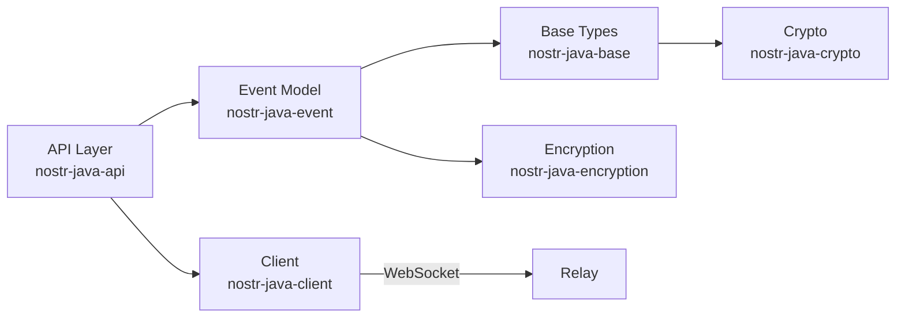
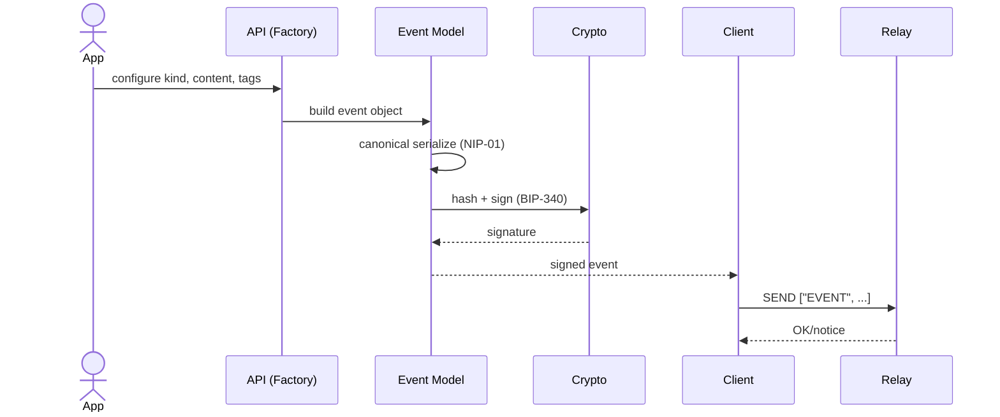

# Architecture

This document explains the overall architecture of nostr-java and how its modules collaborate to implement the Nostr protocol.

**Purpose:** Provide a high-level mental model for contributors and integrators.
**Audience:** Developers extending or integrating the library.
**Last Updated:** 2025-10-06 (Post-refactoring)

---

## Table of Contents

1. [Module Overview](#modules)
2. [Clean Architecture Principles](#clean-architecture-principles)
3. [Data Flow](#data-flow)
4. [Event Lifecycle](#event-lifecycle-happy-path)
5. [Design Patterns](#design-patterns)
6. [Refactored Components](#refactored-components-2025)
7. [Error Handling](#error-handling-principles)
8. [Extensibility](#extensibility)
9. [Security](#security-notes)

---

## Modules

The nostr-java library is organized into 9 modules following Clean Architecture principles with clear dependency direction (lower layers have no knowledge of upper layers).

### Layer 1: Foundation (No Dependencies)

#### `nostr-java-util`
**Purpose:** Cross-cutting utilities and validation helpers.

**Key Classes:**
- `NostrException` hierarchy (protocol, crypto, encoding, network exceptions)
- `NostrUtil` - Common utility methods
- Validators (hex string, Bech32, etc.)

**Dependencies:** None (foundation layer)

#### `nostr-java-crypto`
**Purpose:** Cryptographic primitives and implementations.

**Key Features:**
- BIP-340 Schnorr signature implementation
- Bech32 encoding/decoding (NIP-19)
- secp256k1 elliptic curve operations
- Uses BouncyCastle provider

**Dependencies:** `nostr-java-util`

### Layer 2: Domain Core

#### `nostr-java-base`
**Purpose:** Core domain types and abstractions.

**Key Classes:**
- `PublicKey`, `PrivateKey` - Identity primitives
- `Signature` - BIP-340 signature wrapper
- `Kind` - Event kind enumeration (NIP-01)
- `Encoder`, `IEvent`, `ITag` - Core interfaces
- `RelayUri`, `SubscriptionId` - Value objects (v0.6.2+)
- `NipConstants` - Protocol constants

**Dependencies:** `nostr-java-util`, `nostr-java-crypto`

#### `nostr-java-id`
**Purpose:** Identity and key material management.

**Key Classes:**
- `Identity` - User identity (public/private key pair)
- Key generation and derivation

**Dependencies:** `nostr-java-base`, `nostr-java-crypto`

### Layer 3: Event Model

#### `nostr-java-event`
**Purpose:** Concrete event and tag implementations for all NIPs.

**Key Packages:**
- `nostr.event.impl.*` - Event implementations (GenericEvent, TextNoteEvent, etc.)
- `nostr.event.tag.*` - Tag implementations (EventTag, PubKeyTag, etc.)
- `nostr.event.validator.*` - Event validation (v0.6.2+)
- `nostr.event.serializer.*` - Event serialization (v0.6.2+)
- `nostr.event.util.*` - Event utilities (v0.6.2+)
- `nostr.event.json.*` - JSON mapping utilities (v0.6.2+)
- `nostr.event.message.*` - Relay protocol messages
- `nostr.event.filter.*` - Event filters (REQ messages)

**Recent Refactoring (v0.6.2):**
- Extracted `EventValidator` - NIP-01 validation logic
- Extracted `EventSerializer` - Canonical serialization
- Extracted `EventTypeChecker` - Kind range classification
- Extracted `EventJsonMapper` - Centralized JSON configuration

**Dependencies:** `nostr-java-base`, `nostr-java-id`

#### `nostr-java-encryption`
**Purpose:** NIP-04 and NIP-44 encryption implementations.

**Key Features:**
- NIP-04: Encrypted direct messages (deprecated)
- NIP-44: Versioned encrypted payloads (recommended)

**Dependencies:** `nostr-java-base`, `nostr-java-crypto`

### Layer 4: Infrastructure

#### `nostr-java-client`
**Purpose:** WebSocket transport and relay communication.

**Key Classes:**
- `SpringWebSocketClient` - Spring-based WebSocket implementation
- Retry and resilience mechanisms
- Connection pooling

**Dependencies:** `nostr-java-base`, `nostr-java-event`

### Layer 5: Application/API

#### `nostr-java-api`
**Purpose:** High-level fluent API and factories.

**Key Packages:**
- `nostr.api.nip*` - NIP-specific builders (NIP01, NIP57, NIP60, etc.)
- `nostr.api.factory.*` - Event and tag factories
- `nostr.api.client.*` - Client abstractions and dispatchers

**Recent Refactoring (v0.6.2):**
- Extracted `NIP01EventBuilder`, `NIP01TagFactory`, `NIP01MessageFactory`
- Extracted `NIP57ZapRequestBuilder`, `NIP57ZapReceiptBuilder`, `NIP57TagFactory`
- Extracted `NostrRelayRegistry`, `NostrEventDispatcher`, `NostrRequestDispatcher`, `NostrSubscriptionManager`

**Dependencies:** All lower layers

### Layer 6: Examples

#### `nostr-java-examples`
**Purpose:** Usage examples and demos.

**Contents:**
- Example applications
- Integration patterns
- Best practices

**Dependencies:** `nostr-java-api`

---

## Clean Architecture Principles

The nostr-java codebase follows Clean Architecture principles:

### Dependency Rule
**Dependencies point inward** (from outer layers to inner layers):
```
examples → api → client/encryption → event → base/id → crypto/util
```

Inner layers have **no knowledge** of outer layers. For example:
- `nostr-java-base` does not depend on `nostr-java-event`
- `nostr-java-event` does not depend on `nostr-java-api`
- `nostr-java-crypto` does not depend on Spring or any framework

### Layer Responsibilities

1. **Foundation (util, crypto):** Framework-independent, reusable utilities
2. **Domain Core (base, id):** Business entities and value objects
3. **Event Model (event, encryption):** Domain logic and protocols
4. **Infrastructure (client):** External communication (WebSocket)
5. **Application (api):** Use cases and orchestration
6. **Presentation (examples):** User-facing demos

### Benefits

- ✅ **Testability:** Inner layers test without outer layer dependencies
- ✅ **Flexibility:** Swap implementations (e.g., replace Spring WebSocket)
- ✅ **Maintainability:** Changes in outer layers don't affect core
- ✅ **Framework Independence:** Core domain is pure Java

---

## Data Flow



1. The API layer (factories/builders) creates domain events and tags.
2. Events serialize through base encoders/decoders into canonical NIP-01 JSON.
3. Crypto module signs/verifies (BIP-340), and encryption module handles NIP-04/44.
4. Client sends/receives frames to/from relays via WebSocket.

## Event Lifecycle (Happy Path)



---

## Design Patterns

The nostr-java library employs several well-established design patterns to ensure maintainability and extensibility.

### 1. Facade Pattern

**Where:** NIP implementation classes (NIP01, NIP57, etc.)

**Purpose:** Provide a simplified interface to complex subsystems.

**Example:**
```java
// NIP01 facade coordinates builders, factories, and event management
NIP01 nip01 = new NIP01(identity);
nip01.createTextNoteEvent("Hello World")
     .sign()
     .send(relayUri);

// Internally delegates to:
// - NIP01EventBuilder for event construction
// - NIP01TagFactory for tag creation
// - NIP01MessageFactory for message formatting
// - Event signing and serialization subsystems
```

**Benefits:**
- Simplified API for common use cases
- Hides complexity of event construction
- Clear separation of concerns

### 2. Builder Pattern

**Where:** Event construction, complex parameter objects

**Purpose:** Construct complex objects step-by-step with readable code.

**Examples:**
```java
// GenericEvent builder
GenericEvent event = GenericEvent.builder()
    .pubKey(publicKey)
    .kind(Kind.TEXT_NOTE)
    .content("Hello Nostr!")
    .tags(List.of(eventTag, pubKeyTag))
    .build();

// ZapRequestParameters (Parameter Object pattern)
ZapRequestParameters params = ZapRequestParameters.builder()
    .amount(1000L)
    .lnUrl("lnurl...")
    .relays(relayList)
    .content("Great post!")
    .recipientPubKey(recipient)
    .build();

nip57.createZapRequestEvent(params);
```

**Benefits:**
- Readable event construction
- Handles optional parameters elegantly
- Replaces methods with many parameters

### 3. Template Method Pattern

**Where:** GenericEvent validation

**Purpose:** Define algorithm skeleton in base class, allow subclasses to override specific steps.

**Example:**
```java
// GenericEvent.java
public void validate() {
    // Validate base fields (cannot be overridden)
    EventValidator.validateId(this.id);
    EventValidator.validatePubKey(this.pubKey);
    EventValidator.validateSignature(this.signature);
    EventValidator.validateCreatedAt(this.createdAt);

    // Call protected methods (CAN be overridden by subclasses)
    validateKind();
    validateTags();
    validateContent();
}

protected void validateTags() {
    EventValidator.validateTags(this.tags);
}

// ZapRequestEvent.java (subclass)
@Override
protected void validateTags() {
    super.validateTags(); // Base validation
    // Additional validation: require 'amount' tag
    requireTag("amount");
    requireTag("relays");
}
```

**Benefits:**
- Reuses common validation logic
- Allows specialization in subclasses
- Maintains consistency across event types

### 4. Value Object Pattern

**Where:** RelayUri, SubscriptionId, PublicKey, PrivateKey

**Purpose:** Immutable objects representing domain concepts with no identity, only value.

**Examples:**
```java
// RelayUri - validates WebSocket URIs
RelayUri relay = new RelayUri("wss://relay.damus.io");
// Throws IllegalArgumentException if not ws:// or wss://

// SubscriptionId - type-safe subscription identifiers
SubscriptionId subId = SubscriptionId.of("my-subscription");
// Throws IllegalArgumentException if blank

// Equality based on value, not object identity
RelayUri r1 = new RelayUri("wss://relay.damus.io");
RelayUri r2 = new RelayUri("wss://relay.damus.io");
assert r1.equals(r2); // true - same value
```

**Benefits:**
- Compile-time type safety (can't mix up String parameters)
- Encapsulates validation logic
- Immutable (thread-safe)
- Self-documenting code

### 5. Factory Pattern

**Where:** NIP01TagFactory, NIP57TagFactory, Event factories

**Purpose:** Encapsulate object creation logic.

**Examples:**
```java
// NIP01TagFactory - creates NIP-01 standard tags
BaseTag eventTag = tagFactory.createEventTag(eventId, recommendedRelay);
BaseTag pubKeyTag = tagFactory.createPubKeyTag(publicKey, mainRelay);
BaseTag genericTag = tagFactory.createGenericTag("t", "nostr");

// NIP01EventBuilder - creates events with proper defaults
GenericEvent textNote = eventBuilder.buildTextNote("Hello!");
GenericEvent metadata = eventBuilder.buildMetadata(userMetadata);
```

**Benefits:**
- Centralizes creation logic
- Ensures proper initialization
- Makes testing easier (mock factories)

### 6. Utility Pattern

**Where:** EventValidator, EventSerializer, EventTypeChecker, EventJsonMapper

**Purpose:** Provide static helper methods for common operations.

**Examples:**
```java
// EventValidator - validates NIP-01 fields
EventValidator.validateId(eventId);
EventValidator.validatePubKey(publicKey);
EventValidator.validateSignature(signature);

// EventSerializer - canonical NIP-01 serialization
String json = EventSerializer.serialize(pubKey, createdAt, kind, tags, content);
String eventId = EventSerializer.serializeAndComputeId(...);

// EventTypeChecker - classifies event kinds
boolean isReplaceable = EventTypeChecker.isReplaceable(kind); // 10000-19999
boolean isEphemeral = EventTypeChecker.isEphemeral(kind);     // 20000-29999
boolean isAddressable = EventTypeChecker.isAddressable(kind); // 30000-39999

// EventJsonMapper - centralized JSON configuration
ObjectMapper mapper = EventJsonMapper.getMapper();
String json = mapper.writeValueAsString(event);
```

**Benefits:**
- No object instantiation needed
- Clear single purpose
- Easy to test
- Reusable across the codebase

### 7. Delegation Pattern

**Where:** GenericEvent → Validators/Serializers/TypeCheckers

**Purpose:** Delegate responsibilities to specialized classes.

**Example:**
```java
// GenericEvent delegates instead of implementing directly
public class GenericEvent extends BaseEvent {

    public void update() {
        // Delegates to EventSerializer
        this._serializedEvent = EventSerializer.serializeToBytes(...);
        this.id = EventSerializer.computeEventId(this._serializedEvent);
    }

    public void validate() {
        // Delegates to EventValidator
        EventValidator.validateId(this.id);
        EventValidator.validatePubKey(this.pubKey);
        // ...
    }

    public boolean isReplaceable() {
        // Delegates to EventTypeChecker
        return EventTypeChecker.isReplaceable(this.kind);
    }
}
```

**Benefits:**
- Single Responsibility Principle
- Testable independently
- Reusable logic

### 8. Initialization-on-Demand Holder (Singleton)

**Where:** NostrSpringWebSocketClient

**Purpose:** Thread-safe lazy singleton initialization.

**Example:**
```java
public class NostrSpringWebSocketClient {

    private static final class InstanceHolder {
        private static final NostrSpringWebSocketClient INSTANCE =
            new NostrSpringWebSocketClient();

        private InstanceHolder() {}
    }

    public static NostrIF getInstance() {
        return InstanceHolder.INSTANCE;
    }
}
```

**Benefits:**
- Thread-safe without synchronization overhead
- Lazy initialization (created on first access)
- JVM guarantees initialization safety

---

## Refactored Components (2025)

Recent refactoring efforts (v0.6.2) have significantly improved code organization by extracting god classes into focused, single-responsibility components.

### GenericEvent Extraction

**Before:** 367 lines with mixed responsibilities
**After:** 374 lines + 3 extracted utility classes (472 additional lines)

**Extracted Classes:**

1. **EventValidator** (158 lines) → `nostr.event.validator.EventValidator`
   - Validates all NIP-01 required fields
   - Provides granular validation methods
   - Reusable across the codebase

2. **EventSerializer** (151 lines) → `nostr.event.serializer.EventSerializer`
   - NIP-01 canonical JSON serialization
   - Event ID computation (SHA-256)
   - UTF-8 byte array conversion

3. **EventTypeChecker** (163 lines) → `nostr.event.util.EventTypeChecker`
   - Kind range classification
   - Type name resolution
   - NIP-01 compliance helpers

**Impact:**
- ✅ Improved testability (each class independently testable)
- ✅ Better reusability (use validators/serializers anywhere)
- ✅ Clear responsibilities (SRP compliance)
- ✅ All 170 tests still passing

### NIP01 Extraction

**Before:** 452 lines with multiple responsibilities
**After:** 358 lines + 3 extracted classes (228 additional lines)

**Extracted Classes:**

1. **NIP01EventBuilder** (92 lines) → `nostr.api.nip01.NIP01EventBuilder`
   - Event creation methods
   - Handles defaults and validation

2. **NIP01TagFactory** (97 lines) → `nostr.api.nip01.NIP01TagFactory`
   - Tag creation methods
   - Encapsulates tag construction logic

3. **NIP01MessageFactory** (39 lines) → `nostr.api.nip01.NIP01MessageFactory`
   - Message creation methods
   - Protocol message formatting

**Impact:**
- 21% size reduction in NIP01 class
- Clear facade pattern
- Better testability

### NIP57 Extraction

**Before:** 449 lines with multiple responsibilities
**After:** 251 lines + 4 extracted classes (332 additional lines)

**Extracted Classes:**

1. **NIP57ZapRequestBuilder** (159 lines)
2. **NIP57ZapReceiptBuilder** (70 lines)
3. **NIP57TagFactory** (57 lines)
4. **ZapRequestParameters** (46 lines) - Parameter Object pattern

**Impact:**
- 44% size reduction in NIP57 class
- Parameter object eliminates 7-parameter method
- Clear builder responsibilities

### NostrSpringWebSocketClient Extraction

**Before:** 369 lines with 7 responsibilities
**After:** 232 lines + 5 extracted classes (387 additional lines)

**Extracted Classes:**

1. **NostrRelayRegistry** (127 lines) - Relay lifecycle management
2. **NostrEventDispatcher** (68 lines) - Event transmission
3. **NostrRequestDispatcher** (78 lines) - Request handling
4. **NostrSubscriptionManager** (91 lines) - Subscription lifecycle
5. **WebSocketClientHandlerFactory** (23 lines) - Handler creation

**Impact:**
- 37% size reduction
- Clear separation of concerns
- Each dispatcher/manager has single responsibility

### EventJsonMapper Extraction (v0.6.2)

**Before:** Static ObjectMapper in Encoder interface (anti-pattern)
**After:** Dedicated utility class

**File:** `nostr.event.json.EventJsonMapper` (76 lines)

**Impact:**
- ✅ Removed static field from interface
- ✅ Centralized JSON configuration
- ✅ Better discoverability
- ✅ Comprehensive JavaDoc

---

## Error Handling Principles

### Exception Hierarchy

All domain exceptions extend `NostrRuntimeException` (unchecked):

```
NostrRuntimeException (base)
├── NostrProtocolException (NIP violations)
│   └── NostrException (legacy - protocol errors)
├── NostrCryptoException (signing, encryption)
│   ├── SigningException
│   └── SchnorrException
├── NostrEncodingException (serialization)
│   ├── KeyEncodingException
│   ├── EventEncodingException
│   └── Bech32EncodingException
└── NostrNetworkException (relay communication)
```

### Principles

1. **Validate Early**
   - Validate in constructors and setters
   - Use `@NonNull` annotations
   - Throw `IllegalArgumentException` for invalid input

2. **Fail Fast**
   - Don't silently swallow errors
   - Provide clear, actionable error messages
   - Include context (event ID, kind, field name)

3. **Use Domain Exceptions**
   - Avoid generic `Exception` or `RuntimeException`
   - Use specific exceptions from the hierarchy
   - Makes error handling more precise

4. **Examples:**
   ```java
   // Good - specific exception with context
   throw new EventEncodingException(
       "Failed to encode event to JSON: " + eventId, cause);

   // Good - validation with clear message
   if (kind < 0) {
       throw new IllegalArgumentException(
           "Invalid `kind`: Must be a non-negative integer.");
   }

   // Bad - generic exception
   throw new RuntimeException("Error"); // Don't do this
   ```

---

## Extensibility

### Adding a New NIP Implementation

**Step 1:** Create event class in `nostr-java-event`
```java
@Event(name = "My Custom Event", nip = 99)
public class CustomEvent extends GenericEvent {

    public CustomEvent(PublicKey pubKey, List<BaseTag> tags, String content) {
        super(pubKey, 30099, tags, content); // Use appropriate kind
    }

    @Override
    protected void validateTags() {
        super.validateTags();
        // Add NIP-specific validation
        requireTag("custom-required-tag");
    }
}
```

**Step 2:** Create API facade in `nostr-java-api`
```java
public class NIP99 extends BaseNip {

    private final NIP99EventBuilder eventBuilder;

    public NIP99(Identity sender) {
        super(sender);
        this.eventBuilder = new NIP99EventBuilder(sender);
    }

    public NIP99 createCustomEvent(String content, List<BaseTag> tags) {
        CustomEvent event = eventBuilder.buildCustomEvent(content, tags);
        this.updateEvent(event);
        return this;
    }
}
```

**Step 3:** Add tests
```java
@Test
void testCustomEventCreation() {
    Identity identity = new Identity(privateKey);
    NIP99 nip99 = new NIP99(identity);

    nip99.createCustomEvent("test content", tags)
         .sign();

    GenericEvent event = nip99.getEvent();
    assertEquals(30099, event.getKind());
    event.validate(); // Should not throw
}
```

### Adding a New Tag Type

**Step 1:** Create tag class in `nostr-java-event`
```java
@Tag(code = "x", nip = 99, name = "Custom Tag")
public class CustomTag extends BaseTag {

    public CustomTag(@NonNull String value) {
        super("x");
        this.attributes.add(new Attribute(value, AttributeType.STRING));
    }

    public String getValue() {
        return attributes.get(0).value().toString();
    }
}
```

**Step 2:** Register serializer/deserializer if needed
```java
// Usually handled automatically via @Tag annotation
// Custom serialization only if non-standard format required
```

**Step 3:** Add factory method
```java
// In your NIP's TagFactory
public CustomTag createCustomTag(String value) {
    return new CustomTag(value);
}
```

---

## Security Notes

### Key Management

- ✅ **Private keys never leave the process**
  - Signing uses in-memory data only
  - No network transmission of private keys
  - Use secure key storage externally

- ✅ **Strong RNG**
  - Uses `SecureRandom` with BouncyCastle provider
  - Never reuse nonces or IVs
  - Key generation uses cryptographically secure randomness

### Signing

- ✅ **BIP-340 Schnorr signatures**
  - secp256k1 elliptic curve
  - Deterministic (RFC 6979) for same message = same signature
  - Verifiable by public key

### Encryption

- ✅ **NIP-04 (deprecated)** - AES-256-CBC
  - Use NIP-44 for new applications

- ✅ **NIP-44 (recommended)** - Versioned encryption
  - ChaCha20 stream cipher
  - Poly1305 MAC for authentication
  - Better forward secrecy

### Best Practices

1. **Immutability**
   - Event fields should be immutable after signing
   - Use constructor-based initialization
   - Avoid setters on critical fields

2. **Validation**
   - Always validate events before signing
   - Verify signatures before trusting content
   - Check event ID matches computed hash

3. **Dependencies**
   - Keep crypto dependencies updated
   - Use well-audited libraries (BouncyCastle)
   - Monitor security advisories

---

## Summary

The nostr-java architecture provides:

✅ **Clean separation** of concerns across 9 modules
✅ **Clear dependency direction** following Clean Architecture
✅ **Extensive use of design patterns** for maintainability
✅ **Recent refactoring** eliminated god classes and code smells
✅ **Strong extensibility** points for new NIPs
✅ **Robust error handling** with domain-specific exceptions
✅ **Security-first** approach to cryptography and key management

**Grade:** A- (post-refactoring)
**Test Coverage:** 170+ event tests passing
**NIP Support:** 26 NIPs implemented
**Status:** Production-ready
